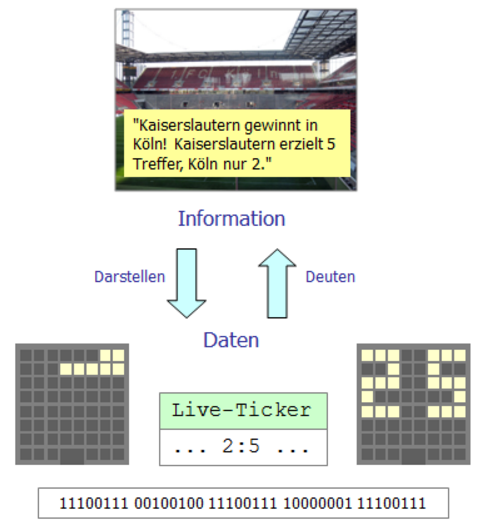
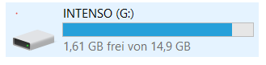
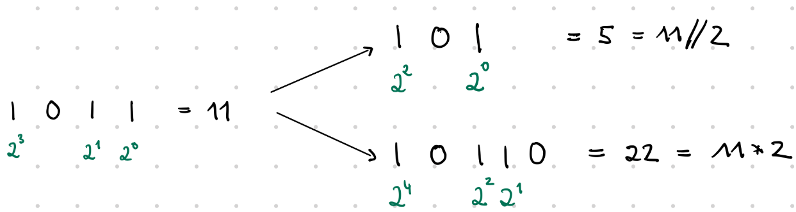
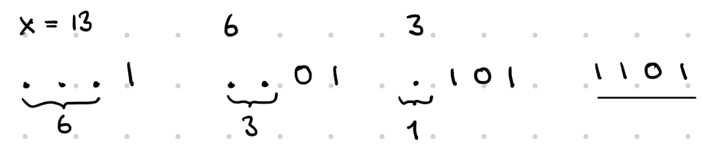

## Daten und Codierung 

---

### Inhalt

1. [Information und Daten, Bits und Bytes](#1-information-und-daten-bits-und-bytes)
2. [Zahlensysteme umrechnen](#2-zahlsysteme-dezimal-binär-hexadezimal)
3. [Datenreduktion bei Bild und Ton](#3-datenreduktion-bei-bild-und-ton)
4. [Lauflängencodierung (RLE)](#4-lauflängencodierung-rle--verlustfrei-komprimieren)
5. [Verlustbehaftet vs. verlustfrei](#5-verlustbehaftete-vs-verlustfreie-kompression)

---

### 1. Information und Daten, Bits und Bytes

#### Information und Daten

**Information** muss immer in geeigneter Weise dargestellt werden, um sie als **Daten** maschinell weiterverarbeiten zu können. Aus Daten gewinnt man erst dann Information, wenn sie gedeutet werden können.



#### Bit und Byte

Zur Darstellung von Information nutzt man häufig Systeme, die nur zwei Zustände einnehmen können: 
 an/aus; geladen/ungeladen; Strom fließt/Strom fließt nicht; magnetisiert/unmagnetisiert.

Unter einem **Bit** versteht man eine Einheit zur Informationsdarstellung, die nur zwei Werte annehmen kann. In der Regel beschreiben wir die beiden Zustände mit den Ziffern 0 und 1. Unter einem **Byte** versteht man eine Einheit aus 8 Bit. (Hinweis: Bei Mengenangaben sagt man Bit und nicht Bits. Also 8 Bit, nicht 8 Bits.)

Werden die Daten nur mit Bits dargestellt spricht man von **Binärdarstellung der Daten**. 

#### Einheiten für Datenmengen

```
    1 Byte                8 Bit     
    1 Kilobyte (KB)    1000 Byte    
    1 Megabyte (MB)    1000 KB      
    1 Gigabyte (GB)    1000 MB   
    1 Terabyte (TB)    1000 GB
```

Die folgenden Einheiten bauen auf Zweierpotenzen statt auf Zehnerpotenzen auf:

```
    1 Byte                8 Bit
    1 Kibibyte (KiB)   1024 Byte
    1 Mebibyte (MiB)   1024 KiB
    1 Gibibyte (GiB)   1024 MiB
    1 Tebibyte (TiB)   1024 GiB
```
 
Die beiden Einheiten werden manchmal mit derselben Abkürzung benutzt, was zu Verwirrung führen kann. Ein 16GB USB-Stick wird im Windows Explorer so angezeigt:



16 Gigabyte $\approx$  14,9 Gibibyte.  


Manchmal wird Bit mit kleinem 'b' und Byte mit großem 'B' abgekürzt. Bei Datenraten finden sich  folgende Einheiten:

```
Mbps = Mbit/s = MegaBit per second
```

### 2. Zahlsysteme: Dezimal, Binär, Hexadezimal 

#### Stellenwertsysteme

```
    Dezimalzahlen:     10 Ziffern: 0,1,2,...9                4719
    Binärzahlen:         2 Ziffern: 0,1                       10010 
    Hexadezimalzahlen: 16 Ziffern: 0,1,2,...9,A,B,C,D,E,F    E52F 
```

Der Wert einer Ziffer hängt von der Stelle in der Zahl ab. Solche Zahlsysteme nennt man **Stellenwertsysteme**. Zu Binärzahlen sagt man häufig auch **Dualzahlen**. 

$(4719)_{10} =   9 \cdot 10^0 + 1 \cdot 10^1 + 7 \cdot 10^2 + 4 \cdot 10^3$ <br>
$(10010)_{2} =   0 \cdot 2^0 + 1 \cdot 2^1 + 0 \cdot 2^2 + 0 \cdot 2^3 + 1 \cdot 2^4 = (18)_{10}$ <br>
$(\mathtt{E52F})_{16} =  15 \cdot 16^0 + 2 \cdot 16^1 + 5 \cdot 16^2 + 14 \cdot 16^3 = (58671)_{10}$

#### Vierergruppen

Binär kodierte Daten lassen sich übersichtlicher mit hexadezimalen Ziffern schreiben. Wir fassen dazu Vierergruppen zusammen.


```
    Binär:  0000 0001 0010 0011 0100 0101 0110 0111 1000 1001 1010 1011 1100 1101 1110 1111
    Hex:     0    1    2    3    4    5    6    7    8    9    A    B    C    D    E    F
```

```
    101011110111000101010000101111000011110101100100010101
    Von rechts in Vierergruppen aufteilen, links ggf. mit 0 auffüllen.
    0010 1011 1101 1100 0101 0100 0010 1111 0000 1111 0101 1001 0001 0101
      2    B    D    C    5    4    2    F    0    F    5    9    1    5
```


#### Binär → Dezimal über Hexadezimal

Statt eine Binärzahl direkt über 2er-Potenzen umzurechnen, kann man sie auch zunächst in Hexadezimal umwandeln und anschließend in Dezimal umrechnen.

Beispiel: `10110101110` (Bin) → Dezimal, über Hex

```
Binär in 4er-Blöcke: 101  1010  1110
Hexadezimal:           5    A     E  
Dezimal:             14*16^0 + 10*16^1 + 5*16^2 = 14 + 160 + 1280 = 1454
```

Zur Kontrolle der direkte Weg für dieselbe Zahl:
```
10110101110 binär = 1*2^1 + 1*2^2 + 1*2^3 + 1*2^5 + 1*2^7 + 1*2^8 + 1*2^10
                   = 2 + 4 + 8 + 32 + 128 + 256 + 1024 = 1454
```


#### Umrechnung Dezimalzahl in Dualzahl

Beobachtung bei Dualzahlen




Bei der ganzzahligen Division durch 2 verschwindet die rechte Ziffer. <br>
Bei der Multiplikation mit 2 kommt rechts noch eine 0 dran.


Bei gegebener Dezimalzahl x können wir die rechte Ziffer der Dualzahl leicht erkennen. Wir dividieren x ganzzahlig durch 2 und bestimmen auf die gleiche Art die restlichen Ziffern. 




Unter die Zahl notieren wir das Ergebnis bei ganzzahliger Division durch 2. Daneben den Rest. 
Das wiederholen wir solange bis wir bei 0 angekommen sind. 
Die Reste von unten nach oben gelesen ergeben die binäre Darstellung.

Beispiel: Wandle 52 in eine Dualzahl um:

```
     52
     26   0
     13   0
      6   1
      3   0
      1   1
      0   1

Ergebnis: 110100

```

Übung:   <br>
1. Wie heißt die Dezimalzahl 90 als Dualzahl?    <br>
2. Wie heißt die Dezimalzahl 3627 als Hexadezimalzahl?

 

### 3. Datenreduktion bei Bild und Ton

Bild- und Audiodateien lassen sich verkleinern, indem man an genau einer von zwei Stellschrauben dreht: **wie oft** gemessen wird oder **wie genau** jede einzelne Messung gespeichert wird. Bei jeder Reduktion gilt: kleinere Datei, aber Informationsverlust.

### Bilder: Auflösung und Farbtiefe

| Größe         | Was sie beschreibt                                           | Wirkung einer Verringerung                                                                              |
| ------------- | ------------------------------------------------------------ | ------------------------------------------------------------------------------------------------------- |
| **Auflösung** | Anzahl der Pixel (Bildpunkte), aus denen das Bild besteht    | Mehrere Nachbarpixel werden zu einem zusammengefasst → gröberes Raster, weniger Pixelwerte zu speichern |
| **Farbtiefe** | Anzahl Bits, mit denen die Farbe *eines* Pixels codiert wird | Weniger unterscheidbare Farben pro Pixel → ähnliche Farbtöne werden zusammengefasst ("Colour Banding")  |

> **Merksatz:** 24 Bit Farbtiefe erlauben ca. 16,7 Mio. Farben; 8 Bit nur noch 256. Die Datenmenge pro Pixel sinkt dabei auf ein Drittel — aber ähnliche Farben werden nicht mehr unterschieden.

### Audio: Samplingrate und Samplingtiefe

Beim Aufnehmen wird die Schallwelle in festen Zeitabständen **abgetastet (gesampelt)**. Die **Samplingrate** (in Hz) gibt an, wie viele Abtastwerte pro Sekunde gespeichert werden.

**Argumentationsmuster für Aufgaben zur Samplingrate:**
1. Verhältnis bilden: neue Rate ÷ alte Rate (z. B. 11 025 Hz ÷ 44 100 Hz = ¼).
2. Folgerung für die Dateigröße: nur noch dieser Anteil an Messwerten pro Sekunde → Datei entsprechend kleiner.
3. Folgerung für die Qualität: hohe Frequenzanteile (hohe Töne) werden nicht mehr korrekt erfasst → Klang wirkt weniger originalgetreu. Es handelt sich um verlustbehaftete Kompression.

---

### 4. Lauflängencodierung (RLE) — verlustfrei komprimieren

Idee: Statt jedes einzelne Bit/Zeichen zu speichern, zählt man, wie oft derselbe Wert **direkt hintereinander** vorkommt, und speichert nur *(Anzahl, Wert)*-Paare. Das funktioniert verlustfrei — beim Entpacken entsteht exakt die Ausgangsfolge zurück.

### Verfahren an einem Schwarz-Weiß-Streifen

Bitfolge (0 = weiß, 1 = schwarz): `0000111111000001111100000`

**Verfahren:**
1. Die Folge in Läufe gleicher Werte zerlegen.
2. Jeden Lauf zählen.
3. Als Paar `(Wert, Anzahl)` bzw. `(Anzahl, Wert)` notieren — je nachdem, was in eurem Unterricht vereinbart wurde.

```
Läufe:     0000 | 111111 | 00000 | 11111 | 00000
Längen:      4  |   6    |   5   |   5   |   5

RLE-Code: (0,4) (1,6) (0,5) (1,5) (0,5)
```

### Datenmenge und Ersparnis berechnen

1. Größte vorkommende Zahl bestimmen → daraus die nötige Bitbreite pro Zahl ableiten (z. B. reicht bei max. 12 eine Breite von 4 Bit, weil 2⁴=16 > 12).
2. Ursprüngliche Datenmenge: Anzahl Bits der Originalfolge × 1 Bit.
3. Komprimierte Datenmenge: Anzahl der Läufe × Bitbreite pro Zahl.
4. Ersparnis: `1 − (komprimiert / original)`, als Prozent angeben.

### Wann lohnt sich RLE — und wann nicht?

RLE lohnt sich nur, wenn viele gleiche Werte *direkt hintereinander* stehen — etwa in einfarbigen Flächen eines Schwarz-Weiß-Bildes. Bei normalem Fließtext (z. B. `"Hallo"`) oder bei Fotos mit vielen leicht unterschiedlichen Farbwerten wechseln sich die Werte zu oft ab, sodass die Läufe kurz bleiben und die codierte Fassung sogar größer werden kann als das Original.

---

### 5. Verlustbehaftete vs. verlustfreie Kompression

Die entscheidende Frage: **Muss nach dem Entpacken exakt das Original wiederhergestellt werden — oder darf ein kleiner, kaum wahrnehmbarer Unterschied entstehen?**

| Format / Anwendung       | Art               | Begründung                                                       |
| ------------------------ | ----------------- | ---------------------------------------------------------------- |
| MP3 (Musik)              | 🔴 verlustbehaftet | Für das Gehör kaum wahrnehmbare Frequenzanteile werden entfernt. |
| JPEG (Foto)              | 🔴 verlustbehaftet | Kompromiss zwischen Dateigröße und Bildqualität.                 |
| PNG (Grafik, Screenshot) | 🟢 verlustfrei     | Bilddaten müssen pixelgenau erhalten bleiben.                    |
| ZIP (Programmcode, Text) | 🟢 verlustfrei     | Nach dem Entpacken muss exakt der Originaltext/-code vorliegen.  |

Programmcode und Textdokumente müssen *bit-genau* erhalten bleiben — schon ein verändertes Zeichen (z. B. ein Semikolon) kann Code unbrauchbar machen oder die Bedeutung eines Textes verändern. Bei Video und Musik nimmt der Mensch kleine Abweichungen dagegen kaum wahr, sodass zugunsten einer viel kleineren Datei ein geringer Qualitätsverlust akzeptiert wird — etwa beim Video-Streaming (begrenzte Bandbreite) oder bei Videotelefonie (Echtzeitübertragung, geringe Latenz wichtiger als volle Qualität).

---
